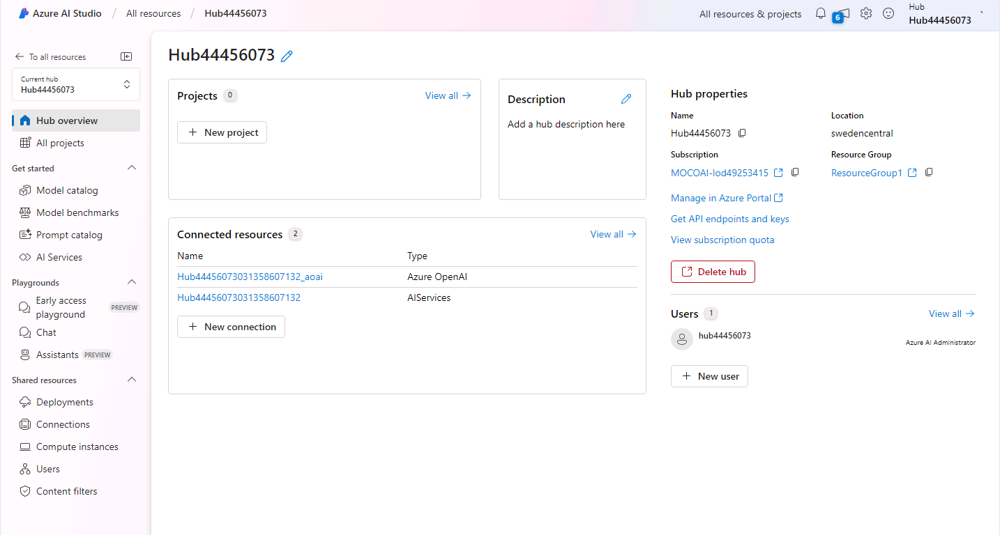
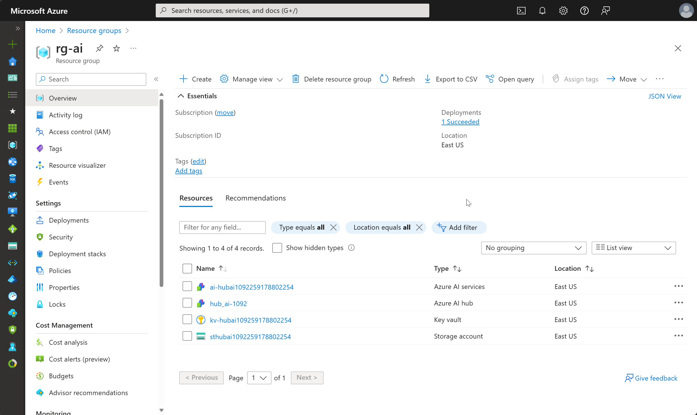

---
lab:
  title: Choisir et déployer un modèle de langage
  description: Les applications IA génératives sont basées sur un ou plusieurs modèles de langage. Découvrez comment rechercher et sélectionner les modèles appropriés pour votre projet d’IA générative.
---

# Choisir et déployer un modèle de langage

Le catalogue de modèles d’Azure AI Foundry sert de référentiel central où vous pouvez explorer et utiliser une variété de modèles, facilitant ainsi la création de votre scénario d’IA générative.

Dans cet exercice, vous allez explorer le catalogue de modèles dans le portail Azure AI Foundry.

Cet exercice prend environ **25** minutes.

## Créer un projet et un hub Azure AI

Un hub Azure AI fournit un espace de travail collaboratif dans lequel vous pouvez définir un ou plusieurs *projets*. Nous allons créer un projet et un hub Azure AI.

1. Dans un navigateur web, ouvrez le [portail Azure Ai Foundry](https://ai.azure.com) à l’adresse `https://ai.azure.com` et connectez-vous en utilisant vos informations d’identification Azure.

1. Sur la page d’accueil, sélectionnez **+Créer un projet**. Dans l’assistant **Créer un projet**, vous pouvez voir toutes les ressources Azure qui seront créées automatiquement avec votre projet, ou vous pouvez personnaliser les paramètres suivants en sélectionnant **Personnaliser** avant de sélectionner **Créer** :

    - **Hub name** : *Un nom unique*
    - **Abonnement** : *votre abonnement Azure*
    - **Groupe de ressources** : *Un nouveau groupe de ressources*
    - **Emplacement** : sélectionnez **Aidez-moi à choisir**, puis sélectionnez **gpt-35-turbo** dans la fenêtre de l’assistant de l’emplacement et utilisez la région recommandée.\*
    - **Connecter Azure AI Services ou Azure OpenAI** : (Nouveauté) *permet de remplir automatiquement le nom de votre hub sélectionné*
    - **Connecter la Recherche Azure AI** : ignorer la connexion

    > \* Les ressources Azure OpenAI sont limitées au niveau du locataire par quotas régionaux. Les régions répertoriées dans l’assistant de l’emplacement incluent le quota par défaut pour le ou les types de modèles utilisés dans cet exercice. Le choix aléatoire d’une région réduit le risque qu’une seule région atteigne sa limite de quota. Si une limite de quota est atteinte plus tard dans l’exercice, vous devrez peut-être créer une autre ressource dans une autre région. En savoir plus sur la [disponibilité du modèle par région](https://learn.microsoft.com/azure/ai-services/openai/concepts/models#gpt-35-turbo-model-availability)

1. Si vous avez sélectionné **Personnaliser**, sélectionnez **Suivant** et passez en revue votre configuration.
1. Sélectionnez **Créer** et patientez jusqu’à ce que l’opération se termine.
   
    Une fois le projet et le hub Azure AI créés, ils devraient ressembler à l’image suivante :

    

1. Ouvrez un nouvel onglet de navigateur (en laissant l’onglet du portail Azure AI Foundry ouvert) et accédez au portail Azure à l’adresse [https://portal.azure.com](https://portal.azure.com?azure-portal=true), en vous connectant avec vos informations d’identification Azure si vous y êtes invité.
1. Accédez au groupe de ressources où vous avez créé votre hub Azure AI et regardez les ressources Azure qui ont été créées.

    

1. Revenez à l’onglet du navigateur du portail Azure AI Foundry.
1. Visualisez chacune des pages dans le volet de gauche de la page de votre hub Azure AI, et notez les artefacts que vous pouvez créer et gérer. Dans la page **Centre d’administration**, vous pouvez sélectionner les **ressources connectées**, dans votre hub ou votre projet, et observer que les connexions aux services Azure OpenAI et AI ont déjà été créées.
1. Si vous êtes dans la page Centre d’administration, sélectionnez **Accéder au projet**.

## Choisir un modèle à l’aide de benchmarks de modèle

Avant de déployer un modèle, vous pouvez explorer les benchmarks de modèle pour déterminer le modèle le mieux adapté à vos besoins.

Imaginez que vous souhaitez créer un copilote personnalisé pour servir d’assistant de voyage. Plus précisément, vous souhaitez que votre copilote facilite les démarches liées aux voyages, telles que l’obtention d’un visa, les prévisions météorologiques, l’apprentissage des attractions locales et des normes culturelles.

Votre copilote devra pour cela fournir des informations justes, et par conséquent fondées. Facteur secondaire mais important également, les réponses du copilote devront être faciles à lire et à comprendre. Par conséquent, vous avez besoin d’un modèle cohérent et doté d’une bonne fluidité.

1. Dans le portail de projet Azure AI Foundry, accédez au **Catalogue de modèles** à l’aide du menu de gauche.
    Sur la page du catalogue, sélectionnez **Comparer avec les benchmarks**. Dans la page Benchmarks de modèles, vous pouvez voir un graphique déjà construit pour vous, qui compare différents modèles.
1. Sélectionnez **+ Modèle à comparer** et ajoutez **gpt-4-32k** et **gpt-4** au graphique de mesures. Dans le menu déroulant **Axe X**, sous **Qualité**, sélectionnez les mesures suivantes et observez chaque graphique obtenu avant de passer au suivant :
    - Cohérence
    - Maîtrise
    - Fondement
1. Lorsque vous passez en revue les résultats, vous pouvez essayer de répondre aux questions suivantes :
    - Remarquez-vous une différence de performances entre les modèles GPT-3.5 et GPT-4 ?
    - Existe-t-il une différence entre différentes versions du même modèle ?
    - En quoi les variantes 32k de GPT-4 diffèrent-elles du modèle de base ?

Dans la collection Azure OpenAI, vous pouvez choisir entre les modèles GPT-3.5 et GPT-4. Déployons ces deux modèles et comparons leur efficacité pour votre cas d’usage.

## Déployer des modèles Azure OpenAI

Maintenant que vous avez exploré vos options via des benchmarks de modèle, vous êtes prêt à déployer des modèles de langage. Vous pouvez parcourir le catalogue de modèles et en déployer un à partir de là, ou vous pouvez le faire via la page **Déploiements**. Examinons les deux options.

### Déployer un modèle à partir du catalogue de modèles

Commençons par déployer un modèle à partir du catalogue de modèles. Cette option est préférable lorsque vous souhaitez filtrer tous les modèles disponibles.

1. Accédez à la page **Catalogue de modèles** à l’aide du menu de gauche.
1. Recherchez et déployez le modèle `gpt-35-turbo`, préparé par Azure AI, avec les paramètres suivants en sélectionnant **Personnaliser** dans les détails du déploiement :
   
    - **Nom du déploiement** : *Un nom unique pour votre modèle de déploiement*
    - **Type de déploiement** : Standard
    - **Version du modèle** : *Sélectionnez la version par défaut*
    -  **Ressource IA** : *sélectionnez la ressource que vous avez créée précédemment.*
    - **Limite de débit en jetons par minute (en milliers)** : 5 000
    - **Filtre de contenu** : DefaultV2
    - **Enable dynamic quota** : désactivé

    > **Remarque** : si votre emplacement actuel de ressource IA n’a pas de quota disponible pour le modèle que vous souhaitez déployer, vous êtes invité à choisir un autre emplacement où une nouvelle ressource IA sera créée et connectée à votre projet.

### Déployer un modèle par le biais de Modèles + points de terminaison

Si vous savez déjà quel modèle vous souhaitez déployer, vous pouvez le faire par le biais de la page **Modèles + points de terminaison**.

1. Accédez à la page **Modèles + points de terminaison** dans la section **Mes ressources**, à l’aide du menu de gauche.
1. Dans l’onglet **Déploiements de modèles**, déployez un nouveau modèle de base avec les paramètres suivants en sélectionnant **Personnaliser** dans les détails du déploiement :
    - **Modèle** : gpt-4
    - **Nom du déploiement** : *Un nom unique pour votre modèle de déploiement*
    - **Type de déploiement** : Standard
    - **Version du modèle** : *Sélectionnez la version par défaut*
    -  **Ressource IA** : *sélectionnez la ressource que vous avez créée précédemment.*
    - **Limite de débit en jetons par minute (en milliers)** : 5 000
    - **Filtre de contenu** : DefaultV2
    - **Enable dynamic quota** : désactivé

## Tester vos modèles dans le terrain de jeu de conversation

Maintenant que nous avons deux modèles à comparer, examinons leur comportement dans le cadre d’une interaction conversationnelle.

1. Accédez à la page **Terrains de jeu** à l’aide du menu de gauche.
1. Dans le** terrain de jeu de conversation**, sélectionnez votre déploiement GPT-3.5.
1. Dans la fenêtre de conversation, entrez la requête `What can you do?` et lisez la réponse.
    Elle sera très générique. Souvenez-vous que nous voulons créer un copilote personnalisé pour servir d’assistant de voyage. Vous pouvez spécifier le type d’aide souhaité tout en posant votre question.
1. Dans la fenêtre de conversation, entrez la requête `Imagine you're a travel assistant, what can you help me with?` La réponse sera déjà plus précise. Vous voudrez peut-être éviter à vos utilisateurs finaux de devoir préciser le contexte chaque fois qu’ils interagiront avec votre copilote. Pour ajouter des instructions globales, vous pouvez modifier le message système.
1. Dans **Configuration**, mettez à jour le champ **Donner des instructions et du contexte au modèle** à l’aide de l’invite suivante :

   ```
   You are an AI travel assistant that helps people plan their trips. Your objective is to offer support for travel-related inquiries, such as visa requirements, weather forecasts, local attractions, and cultural norms.
   ```

1. Sélectionnez **Appliquer les modifications**.
1. Dans la fenêtre de conversation, entrez la requête `What can you do?` et lisez la nouvelle réponse. Elle devrait être très différente de la réponse que vous avez reçue précédemment. La réponse est maintenant adaptée au contexte de voyages.
1. Poursuivez la conversation en demandant : `I'm planning a trip to London, what can I do there?` Le copilote affichera de nombreuses informations liées aux voyages. Vous souhaiterez peut-être améliorer davantage la qualité de cette réponse. Par exemple, afin qu’elle soit plus succincte.
1. Mettez à jour le message système en ajoutant `Answer with a maximum of two sentences.` à la fin du message. Appliquez la modification, effacez la conversation et procédez à un nouveau test en demandant : `I'm planning a trip to London, what can I do there?` Vous voudrez peut-être également que votre copilote continue la conversation au lieu de simplement répondre à la question.
1. Mettez à jour le contexte du modèle en ajoutant `End your answer with a follow-up question.` à la fin de l’invite. Enregistrez la modification, puis testez à nouveau la conversation en demandant : `I'm planning a trip to London, what can I do there?`
1. Remplacez votre **Déploiement** par votre modèle GPT-4 et répétez toutes les étapes de cette section. Vous devriez observer des différences entre les réponses des deux modèles.
1. Enfin, testez les deux modèles avec la requête `Who is the prime minister of the UK?`. Avec cette question, le niveau de performance dépend du fondement (la capacité à fournir des réponses factuellement exactes) des modèles. Les performances correspondent-elles aux conclusions des benchmarks de modèle ?

Maintenant que vous avez exploré les deux modèles, essayez de déterminer celui qui conviendra le mieux à votre cas d’usage. Au début, les sorties des deux modèles peuvent différer, et vous pouvez être tenté de préférer un modèle à l’autre. Toutefois, après avoir mis à jour le message système, les différences vous sembleront sans doute minimes. Dans une optique d’optimisation des coûts, vous pouvez alors opter pour le modèle GPT-3.5 plutôt que le modèle GPT-4, car leurs performances sont très similaires.

## Nettoyage

Si vous avez terminé d’explorer Azure AI Foundry, vous devez supprimer les ressources que vous avez créées dans cet exercice pour éviter d’entraîner des coûts Azure inutiles.

1. Revenez à l’onglet du navigateur contenant le portail Azure (ou ouvrez à nouveau le [portail Azure](https://portal.azure.com?azure-portal=true) dans un nouvel onglet de navigateur) et affichez le contenu du groupe de ressources où vous avez déployé les ressources utilisées dans cet exercice.
1. Dans la barre d’outils, sélectionnez **Supprimer le groupe de ressources**.
1. Entrez le nom du groupe de ressources et confirmez que vous souhaitez le supprimer.
