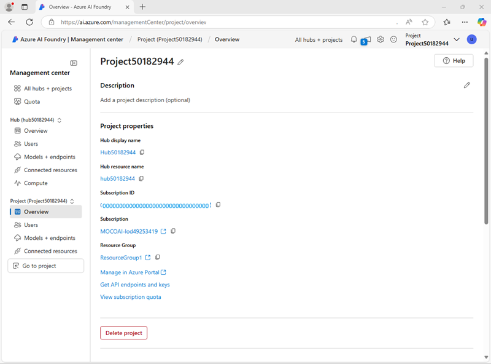

---
lab:
  title: Utiliser un flux d’invite pour gérer la conversation dans une application de conversation
  description: Découvrez comment utiliser des flux d’invite pour gérer les dialogues conversationnels et vérifier que les invites sont construites et orchestrées pour obtenir de meilleurs résultats.
---

# Utiliser un flux d’invite pour gérer la conversation dans une application de conversation

Dans cet exercice, vous allez utiliser le flux d’invite du portail Azure AI Foundry pour créer une application de conversation personnalisée qui utilise une invite utilisateur et un historique des conversations comme entrées, et qui utilise un modèle GPT d’Azure OpenAI pour générer un résultat.

Cet exercice prend environ **30** minutes.

## Créer un projet Azure AI Foundry

Commençons par créer un projet Azure AI Foundry.

1. Dans un navigateur web, ouvrez le [portail Azure AI Foundry](https://ai.azure.com) à l’adresse `https://ai.azure.com` et connectez-vous en utilisant vos informations d’identification Azure. Fermez les conseils ou les volets de démarrage rapide ouverts la première fois que vous vous connectez et, si nécessaire, utilisez le logo **Azure AI Foundry** en haut à gauche pour accéder à la page d’accueil, qui ressemble à l’image suivante :

    

1. Sur la page d’accueil, sélectionnez **+Créer un projet**.
1. Dans l’assistant **Créer un projet**, saisissez un nom valide pour votre projet. Si un hub existant est suggéré, choisissez l’option permettant d’en créer un nouveau. Passez ensuite en revue les ressources Azure qui seront créées automatiquement pour prendre en charge votre hub et votre projet.
1. Sélectionnez **Personnaliser** et spécifiez les paramètres suivants pour votre hub :
    - **Nom du hub** : *un nom valide pour votre hub*
    - **Abonnement** : *votre abonnement Azure*
    - **Groupe de ressources** : *créez ou sélectionnez un groupe de ressources*
    - **Emplacement** : sélectionnez **Aidez-moi à choisir**, puis sélectionnez **gpt-4o** dans la fenêtre d’aide à la sélection de l’emplacement et utilisez la région recommandée\*
    - **Connecter Azure AI Services ou Azure OpenAI** : *créer une nouvelle ressource AI Services*
    - **Connecter la Recherche Azure AI** : ignorer la connexion

    > \*Les ressources Azure OpenAI sont soumises à des quotas de modèle par région. En cas de dépassement de quota au cours de l’exercice, vous devrez peut-être créer une autre ressource dans une région différente.

1. Sélectionnez **Suivant** et passez en revue votre configuration. Sélectionnez **Créer** et patientez jusqu’à ce que l’opération se termine.
1. Une fois votre projet créé, fermez les conseils affichés et passez en revue la page du projet dans le portail Azure AI Foundry, qui doit ressembler à l’image suivante :

    

## Configurer l’autorisation des ressources

Les outils de flux d’invite dans Azure AI Foundry créent des ressources basées sur des fichiers qui définissent le flux d’invite dans un dossier du stockage blob. Avant d’explorer le flux d’invite, assurons-nous que votre ressource Azure AI Services dispose des accès requis au stockage blob afin de pouvoir les lire.

1. Dans le portail Azure AI Foundry, dans le volet de navigation, sélectionnez le **Centre de gestion** et affichez la page de détails de votre projet, qui ressemble à l’image suivante :

    

1. Sous **Groupe de ressources**, sélectionnez votre groupe de ressources pour l’ouvrir dans le portail Azure dans un nouvel onglet de navigateur. Connectez-vous avec vos identifiants Azure si cela vous est demandé et fermez les notifications de bienvenue pour afficher la page du groupe de ressources.

    Le groupe de ressources contient l’ensemble des ressources Azure nécessaires pour prendre en charge votre hub et votre projet.

1. Sélectionnez la ressource **Azure AI Services** associée à votre hub pour l’ouvrir. Déployez ensuite sa section **Dans Gestion des ressources**, puis sélectionnez la page **Identité** :

    

1. Si l’état de l’identité système attribuée est **Désactivé**, activez-le avec **Activé** et enregistrez vos modifications. Attendez ensuite la confirmation du changement d’état.
1. Revenez à la page du groupe de ressources, puis sélectionnez la ressource **Compte de stockage** de votre hub et accédez à sa page **Contrôle d’accès (IAM)**  :

    

1. Ajoutez une attribution de rôle au rôle `Storage blob data reader`pour l’identité managée utilisée par votre ressource Azure AI Services :

    

1. Une fois que vous avez vérifié et attribué les autorisations permettant à l’identité managée d’Azure AI Services de lire les blobs dans le compte de stockage, fermez l’onglet du portail Azure et retournez dans le portail Azure AI Foundry.
1. Dans le portail Azure AI Foundry, dans le volet de navigation, sélectionnez **Aller au projet** pour revenir à la page d’accueil de votre projet.

## Déployer un modèle d’IA générative

Vous êtes maintenant prêt à déployer un modèle de langage génératif pour prendre en charge votre application de flux d’invite.

1. Dans le volet de gauche de votre projet, dans la section **Mes ressources**, sélectionnez la page **Modèles + points de terminaison**.
1. Sur la page **Modèles + points de terminaison**, dans l’onglet **Déploiements de modèles**, dans le menu **+ Déployer un modèle**, sélectionnez **Déployer le modèle de base**.
1. Recherchez le modèle **gpt-4** dans la liste, puis sélectionnez-le et confirmez votre choix.
1. Déployez le modèle avec les paramètres suivants en sélectionnant **Personnaliser** dans les détails du déploiement :
    - **Nom du déploiement** : *Un nom valide pour le modèle de déploiement*
    - **Type de déploiement** : standard global
    - **Mise à jour automatique de la version** : Activée
    - **Version du modèle** : *Sélectionnez la version la plus récente disponible*
    - **Ressource IA connectée** : *sélectionnez votre connexion de ressources Azure OpenAI*
    - **Limite de jetons par minute (en milliers)**  : 50K *(ou le maximum disponible dans votre abonnement si inférieur à 50K)*
    - **Filtre de contenu** : DefaultV2

    > **Remarque** : La réduction du nombre de jetons par minute permet d’éviter une surutilisation du quota disponible dans l’abonnement que vous utilisez. 50 000 TPM devraient suffire pour les données utilisées dans cet exercice. Si votre quota disponible est inférieur à cette valeur, vous pourrez tout de même terminer l’exercice, mais vous pourriez rencontrer des erreurs en cas de dépassement de la limite.

1. Attendez la fin du déploiement.

## Créer un flux d’invite

Un flux d’invite permet d’orchestrer des invites et d’autres activités afin de définir une interaction avec un modèle d’IA générative. Dans cet exercice, vous utiliserez un modèle pour créer un flux de conversation instantanée simple pour un assistant IA dans une agence de voyages.

1. Dans la barre de navigation du portail Azure AI Foundry, dans la section **Créer et personnaliser**, sélectionnez **Flux d’invite**.
1. Créez un nouveau flux basé sur le modèle **Flux de conversation**, en indiquant `Travel-Chat`comme nom de dossier.

    Un flux de conversation instantanée simple est créé pour vous.

1. Pour pouvoir tester votre flux, une ressource de calcul est nécessaire, et son démarrage peut prendre du temps ; sélectionnez donc **Démarrer une session de calcul** pour lancer le processus pendant que vous explorez et modifiez le flux par défaut.

1. Affichez le flux d’invite, qui se compose d’une série d’*entrées*, de *sorties* et d’*outils*. Vous pouvez développer et modifier les propriétés de ces objets dans les volets d’édition à gauche, et visualiser l’ensemble du flux sous forme de graphe à droite :

    

1. Affichez le volet **Entrées**, et notez qu’il comporte deux entrées (l’historique des conversations et la question de l’utilisateur)
1. Affichez le volet **Sorties** et notez qu’il contient une sortie correspondant à la réponse du modèle.
1. Affichez le volet de l’outil LLM **Conversation instantanée**, qui contient les informations nécessaires pour soumettre une invite au modèle.
1. Dans le volet de l’outil LLM **Conversation instantanée**, pour **Connexion**, sélectionnez la connexion à la ressource Azure OpenAI de votre hub IA. Configurez ensuite les propriétés de connexion suivantes :
    - **Api**: conversation
    - **deployment_name** : *le modèle gpt-4o que vous avez déployé*
    - **response_format** : {"type":"text"}
1. Modifiez le champ **Invite** comme suit :

   ```yml
   # system:
   **Objective**: Assist users with travel-related inquiries, offering tips, advice, and recommendations as a knowledgeable travel agent.

   **Capabilities**:
   - Provide up-to-date travel information, including destinations, accommodations, transportation, and local attractions.
   - Offer personalized travel suggestions based on user preferences, budget, and travel dates.
   - Share tips on packing, safety, and navigating travel disruptions.
   - Help with itinerary planning, including optimal routes and must-see landmarks.
   - Answer common travel questions and provide solutions to potential travel issues.

   **Instructions**:
   1. Engage with the user in a friendly and professional manner, as a travel agent would.
   2. Use available resources to provide accurate and relevant travel information.
   3. Tailor responses to the user's specific travel needs and interests.
   4. Ensure recommendations are practical and consider the user's safety and comfort.
   5. Encourage the user to ask follow-up questions for further assistance.

   
   # user:
   {{item.inputs.question}}
   # assistant:
   {{item.outputs.answer}}
   

   # user:
   {{question}}
   ```

    Lisez l’invite que vous avez ajoutée pour vous familiariser avec celle-ci. Elle se compose d’un message système (qui inclut un objectif, une définition de ses capacités et quelques instructions), ainsi que de l’historique des conversations (ordonné pour afficher chaque question posée par l’utilisateur et chaque réponse antérieure de l’assistant).

1. Dans la section **Entrées** de l’outil LLM **Conversation instantanée** (sous l’invite), assurez-vous que les variables suivantes sont définies :
    - **question** (chaîne) : ${inputs.question}
    - **chat_history** (string) : ${inputs.chat_history}

1. Enregistrez les modifications apportées au flux.

    > **Remarque** : dans cet exercice, nous nous en tiendrons à un flux de conversation instantanée simple, mais notez que l’éditeur de flux d’invite comprend de nombreux autres outils que vous pouvez ajouter au flux pour créer une logique complexe et orchestrer des conversations.

## Tester le flux

Maintenant que vous avez développé le flux, vous pouvez utiliser la fenêtre de conversation pour le tester.

1. Assurez-vous que la session de calcul est en cours d'exécution. Sinon, attendez que le démarrage s’effectue.
1. Dans la barre d’outils, sélectionnez **Conversation instantanée** pour ouvrir le volet **Conversation instantanée**, puis attendez l’initialisation de la conversation.
1. Entrez la requête : `I have one day in London, what should I do?` et passez en revue la sortie. Le volet Conversation instantanée devrait ressembler à ceci :

    

## Déployer le flux

Lorsque vous êtes satisfait du comportement du flux que vous avez créé, vous pouvez le déployer.

> **Remarque** : le déploiement peut être long et être affecté par des contraintes de capacité liées à votre abonnement ou à votre environnement.

1. Dans la barre d’outils, sélectionnez **Déployer** et déployez le flux avec les paramètres suivants :
    - **Paramètres de base** :
        - **Point de terminaison** : Nouvelle
        - **Nom du point de terminaison** : *Entrez un nom unique*
        - **Nom du déploiement** : *Entrez un nom unique*
        - **Machine virtuelle** : Standard_DS3_v2
        - **Nombre d’instances** : 1
        - **Collecte de données d’inférence** : désactivée
    - **Paramètres avancés** :
        - *Utiliser les paramètres par défaut*
1. Dans le portail Azure AI Foundry, dans le volet de navigation, dans la section **Mes ressources**, sélectionnez la page **Modèles + points de terminaison**.

    Si la page s’ouvre directement sur votre modèle gpt-4o, utilisez le bouton **Retour** pour afficher tous les modèles et points de terminaison.

1. Au départ, la page peut n’afficher que vos déploiements de modèles. L’apparition du déploiement dans la liste peut prendre un certain temps, et sa création effective peut être encore plus longue.
1. Lorsque le déploiement a *réussi*, sélectionnez-le. Accédez ensuite à sa page **Test**.

    > **Conseil** : si la page de test indique que le point de terminaison est défectueux, revenez à la page **modèles et points de terminaison**, attendez une minute environ, puis actualisez la vue avant de sélectionner à nouveau le point de terminaison.

1. Entrez l’invite `What is there to do in San Francisco?` et examinez la réponse.
1. Entrez l’invite `Tell me something about the history of the city.` et examinez la réponse.

    Le volet de test devrait ressembler à ceci :

    

1. Affichez la page **Consommer** du point de terminaison, et notez qu’elle contient les informations de connexion ainsi que du code d’exemple que vous pouvez utiliser pour créer une application cliente pour votre point de terminaison. Cela permet d’intégrer la solution de flux d’invite dans une application en tant qu’application d’IA générative.

## Nettoyage

Une fois votre exploration du flux d’invite terminée, supprimez les ressources que vous avez créées afin d’éviter des coûts Azure inutiles.

- Accédez au [portail Azure](https://portal.azure.com) à l’adresse `https://portal.azure.com`.
- Dans le portail Azure, dans la page **Accueil**, sélectionnez **Groupes de ressources**.
- Sélectionnez le groupe de ressources créé pour cet exercice.
- Au sommet de la page **Vue d’ensemble** de votre groupe de ressources, sélectionnez **Supprimer le groupe de ressources**.
- Entrez le nom du groupe de ressources pour confirmer que vous souhaitez le supprimer, puis sélectionnez **Supprimer**.
