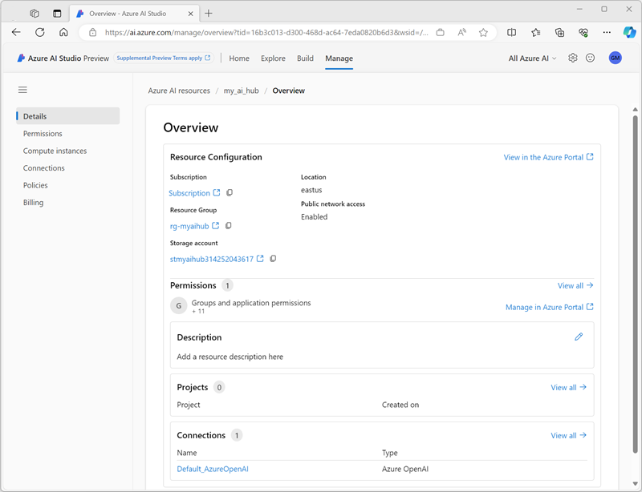

---
lab:
  title: Explorer Azure AI Studio
---

# Explorer Azure AI Studio

Dans cet exercice, vous allez utiliser Azure AI Studio pour créer un projet et explorer un modèle d’IA générative.

> **Remarque** : Azure AI Studio est en préversion au moment de la rédaction du présent document et fait l’objet d’un développement actif. Certains éléments du service peuvent ne pas être exactement tels qu’ils sont décrits, et certaines fonctionnalités peuvent ne pas fonctionner comme prévu.

> Pour effectuer cet exercice, votre abonnement Azure doit être approuvé pour un accès au service Azure OpenAI.

Cet exercice prend environ **30** minutes.

## Ouvrir Azure AI Studio

Commençons par examiner Azure AI Studio.

1. Dans un navigateur web, ouvrez [https://ai.azure.com](https://ai.azure.com) et connectez-vous à l’aide de vos informations d’identification Azure. La page d’accueil d’Azure AI Studio ressemble à l’image suivante :

    

1. Passez en revue les informations de la page d’accueil et affichez chacun des onglets, en notant les options permettant d’explorer les modèles et les fonctionnalités, de créer des projets et de gérer des ressources.

## Créer un hub Azure AI

Vous avez besoin d’un hub Azure AI dans votre abonnement Azure pour héberger des projets. Vous pouvez créer cette ressource lors de la création d’un projet ou bien l’approvisionner à l’avance (c’est ce que nous allons faire dans cet exercice).

1. Dans la page **Gérer**, sélectionnez **+ Nouveau hub Azure AI**. Ensuite, dans l’Assistant **Création d’un hub Azure AI**, créez une ressource avec les paramètres suivants :
    - **Nom du hub Azure AI** : *Un nom unique*
    - **Abonnement** : *votre abonnement Azure*
    - **Groupe de ressources** : *Créer un groupe de ressources avec un nom unique ou sélectionner un groupe de ressources existant*
    - **Emplacement** : *Choisir n’importe quel emplacement pris en charge par le service Azure OpenAI*
    - **Azure OpenAI** : (Nouveau) ai-*nom_hub*
    - **Recherche IA** : (Aucun)

    Une fois le hub Azure AI créé, il doit être similaire à l’image suivante :

    

1. Ouvrez un nouvel onglet de navigateur (en laissant l’onglet Azure AI Studio ouvert) et accédez au portail Azure à l’adresse [https://portal.azure.com](https://portal.azure.com?azure-portal=true), en vous connectant avec vos informations d’identification Azure si vous y êtes invité.
1. Accédez au groupe de ressources où vous avez créé votre hub Azure AI et regardez les ressources Azure qui ont été créées.

    

1. Revenez à l’onglet Azure AI Studio dans le navigateur.
1. Visualisez chacune des pages dans le volet de gauche de la page de votre hub Azure AI, et notez les artefacts que vous pouvez créer et gérer. Dans la page **Connexions**, notez qu’une connexion à la ressource Azure OpenAI que vous avez créée avec votre hub Azure AI nommé **Default_AzureOpenAI** a déjà été créée.

## Création d’un projet

Un hub Azure AI fournit un espace de travail collaboratif dans lequel vous pouvez définir un ou plusieurs *projets*. Nous allons créer un projet dans votre hub Azure AI.

1. Dans Azure AI Studio, sur la page **Build**, sélectionnez **+ Nouveau projet**. Ensuite, dans l’Assistant **Création d’un projet**, créez un projet avec les paramètres suivants :
    - **Nom du projet** : *Un nom unique pour votre projet*
    - **Hub AI** : *Votre hub AI*
1. Attendez que votre projet soit créé. Quand il est prêt, il doit ressembler à l’image suivante :

    

1. Affichez les pages du volet de gauche, en développant chaque section, et notez les tâches que vous pouvez effectuer et les ressources que vous pouvez gérer dans un projet.

## Déployer et tester un modèle

Vous pouvez utiliser un projet pour créer des solutions IA complexes basées sur des modèles IA génératifs. Une exploration complète de toutes les options de développement disponibles dans Azure AI Studio dépasse l’étendue de cet exercice, mais nous allons explorer des fonctions de base que vous pouvez utiliser pour travailler avec des modèles dans un projet.

1. Dans le volet de gauche de votre projet, dans la section **Composants**, sélectionnez la page **Déploiements**.
1. Dans la page **Déploiements**, sélectionnez **+ Créer** et créez un déploiement de point de terminaison en temps réel.
1. Dans la liste **Sélectionner un modèle** , sélectionnez le modèle **gpt-35-turbo** et confirmez votre sélection. Déployez ensuite le modèle avec les paramètres suivants :
    - **Nom du déploiement** : *Un nom unique pour votre modèle de déploiement*
    - **Modèle** : gpt-35-turbo
    - **Version du modèle** : *Sélectionnez la version par défaut*
    - **Options avancées** :
        - **Filtre de contenu** : valeur par défaut
        - **Type de déploiement** : Standard
        - **Limite de débit en jetons par minute (en milliers)** : 5 000

    > **Remarque** : La réduction du nombre de jetons par minute permet d’éviter une surutilisation du quota disponible dans l’abonnement que vous utilisez. 5 000 jetons par minute sont suffisants pour les données utilisées dans cet exercice.

1. Une fois le modèle déployé, dans le volet de gauche, dans la section **Outils**, sélectionnez la page **Terrain de jeu**.
1. Sur la page **Terrain de jeu**, vérifiez que votre modèle de déploiement est sélectionné dans la section **Configuration**. Ensuite, dans la section **Session de conversation**, entrez une requête, par exemple *Qu’est-ce que l’IA ?* et examinez la réponse :

    

## Nettoyage

Si vous avez terminé d’explorer Azure AI Studio, vous devez supprimer les ressources que vous avez créées dans cet exercice pour éviter d’entraîner des coûts Azure inutiles.

1. Revenez à l’onglet du navigateur contenant le portail Azure (ou ouvrez à nouveau le [portail Azure](https://portal.azure.com?azure-portal=true) dans un nouvel onglet de navigateur) et affichez le contenu du groupe de ressources où vous avez déployé les ressources utilisées dans cet exercice.
1. Dans la barre d’outils, sélectionnez **Supprimer le groupe de ressources**.
1. Entrez le nom du groupe de ressources et confirmez que vous souhaitez le supprimer.
